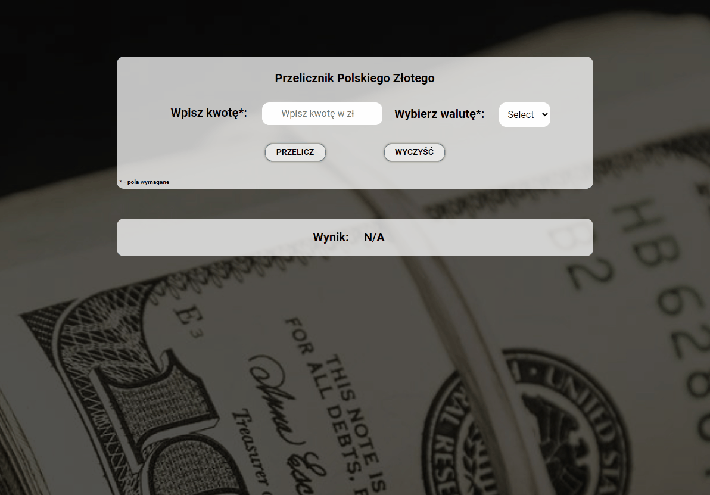

# Currency-Converter

## DEMO

https://jerszynski.github.io/currency-converter/

---

#### Languages used in project:

 

- HTML
- BEM Convention
- CSS
  - Flex box
- JavaScript

---

Welcome to my second website where you can test my Currency-Converter. It's another project where I'm testing my skill with HTML, CSS, and JavaScript.  
Hope you will like it :)
 
 
Below you can find a small sneak peek of the website.

